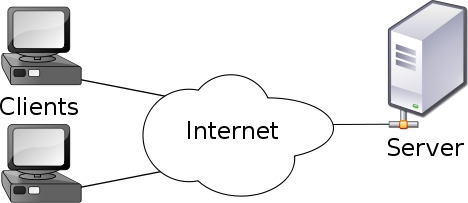

# Week 05: 2/24/26

## Agenda

1. Reading Discussion #3 (25 min)
2. A Type of Web Design Process (20 min)
3. Introduction to Servers (45 min)

---

## A Type of Web Design Process

1. Research + Inspiration
2. Concept
3. Information Architecture + User Experience
4. Visual Design
5. Implementation (structure, style, interaction)

#### **1. Research + Inspiration**

- [Rhizome Net Art Anthology](https://anthology.rhizome.org/) | [Rhizome Artbase](https://artbase.rhizome.org/wiki/Main_Page)
- [21st Century Digital Art](http://www.digiart21.org/)
- [Creative Applications](https://www.creativeapplications.net/)
- [Artists Featured in Form and Code](http://formandcode.com/links)
- [linci.co Design Bookmarks](https://bookmarks.linci.co/)
- Tumblr, Instagram, Are.na, Social Media etc...

##### ACTIVITY

In this [shared doc](https://docs.google.com/document/d/1rHOvKEcuYIwY3MEzbB6moIXSshdcIVGlSzGd65DgZnE/edit?usp=sharing) take 5-10 minutes to add where you look/get/find news, inspiration, mood boards

add your name and a few links to places you check :)

##### How do you organize your research?

In the past I was a Notion enjoyer...


You can add a [notion extension](https://github.com/dvanoni/notero#configure-notion) to your browser for quick bookmarking.

Now I am an [are.na](https://are.na) enjoyer.

##### Keep a research journal!

- digital (pinterest, are.na, google docs / sheet/slides, notion, miro, figma, folder on your computer)
- physical

#### 2. Concept

- spend time [mind-mapping](https://www.gandanet.com.hk/WikIT/index.php?title=How_to_make_a_mind_map) and actually thinking about multiple concepts before implementing them

#### 3. Information Architecture + User Experience

- sitemaps → blueprint / outline for your entire website
  - list with nested items
  - diagram of pen and paper
  - online tools (miro, figma, google doc)
- wireframes → blueprint for individual pages
  - pen + paper
  - figma
  - miro, google slides, adobe

#### 4. Visual Design

- take your wireframe to higher fidelity
- how does the website look?
- how does the design work towards conveying your concept?

color

- color scheme generators: [coolors.co](https://coolors.co/)

typography

- google fonts
- adobe fonts
- [typefoundry](https://typefoundry.directory/)
- github + search of font name

accessibility -[w3c accessability guidelines](https://www.w3.org/WAI/standards-guidelines/)

## Introduction to Servers



When we request information from a server, it can be broken down into one of 9 different types of requests. We will pretty much only work with 4:

<!-- prettier-ignore -->
| Request  | Info | Example |
| --- | --- | --- |
| `GET`| retrieving information, usually a webpage or file | visiting a webpage via url |
| `POST`| sending information, usually via a form | creating an account |
| `PUT` | updating information on the server, usually via a form | updating a password |
| `DELETE` | deleting information on the server, usually via a form | deleting an account |

See WizardZines for an explanation on all the requests:

- [Part 1](https://wizardzines.com/comics/request-methods-1/)
- [Part 2](https://wizardzines.com/comics/request-methods-2/)

Specifically, a lot of servers use Representational State Transfer (REST) as the core schematic for constructing a request.

### Node.js, npm, and Express

<!-- prettier-ignore -->
| Module | Library | Framework | Runtime Environment |
| --- | --- | --- | --- |
| fingers | hands | body | environment |
| part of the program | interact with other programs | complete system | how the program is run |
| `server.js` | `Express.js`, `p5.js` | `React.js`, `Ember.js`, `Vue.js`, `Angular.js` | `Node.js` |

from [modules, libraries, and frameworks](https://stackoverflow.com/questions/4099975/difference-between-a-module-library-and-a-framework)

#### Node.js

A runtime environment (or engine) to run JavaScript as a standalone application using frameworks and modules.

From [Node.js docs](https://nodejs.org/en/learn/getting-started/differences-between-nodejs-and-the-browser):

> Node.js apps bring with them a huge advantage: the comfort of programming everything - the frontend and the backend - in a single language.

#### npm

**N**ode **P**ackage **M**anager, which gives us _access_ to frameworks and modules, kept track in `package.json`

#### Express.js

A Node framework to create web applications.

#### Local: Setting Up a Server On Our Computer

On your computer, create a new class10 folder inside your `class-demos` folder, then open VS Code. Ideally, you should open it in the folder that you will be using to follow along with this class demo. For example, my folder I will open will be `/Users/samheckle/dev/spring-26/networked-media-sp-26/class-demos/class10/` instead of the base `networked-media-sp-26` folder. The reason this is helpful is so that when we open the terminal in VS Code, we will already be inside the correct folder in the terminal.

Open the terminal in VS Code and run:

```bash
npm init
```

and **hit enter for all the questions you get asked** (you can fill in answers, but the defaults work fine.) This initializes our node project.

Once the project is initialized, we need to install an external library called Express JS. [Express](http://expressjs.com/) is a small, easy to use framework which allows us to create web servers in node without having to write too much code. It’s the library that does all the heavy lifting in allowing us to create a web server.

Run the following command in order to add `express` as a dependency to the current project:

```bash
npm install express
```

At this point, if you run `ls`, you should see the following files in your folder:

- `node_modules` → this is the folder where all our project dependencies get saved. If you run `ls node_modules`, you will see a handful of results. `express` will be one of them, the other ones are dependencies of `express`.
- `package.json` → this is our node project configuration file. It specifies some metadata about our node project, as well as our dependencies. If you run `cat package.json`, you’ll be able to see that `express` appears under the `dependencies` section of the file.
- `package-lock.json` → we don’t care about this file, it’s used by node internally to keep track of exact library versions for the entire dependency tree.

This is the default barebones structure of a node project, so you should get used to seeing `node_modules` and `package.json` around. The only thing that’s missing is some actual code to define and run our web server.

#### Local: Creating a server.js file

Open your code editor and create a new file, under the name `server.js`.

#### Breaking down the `server.js`

Below is the order that the `server.js` code will exist.

1. Import libraries into a global variable

`require` is syntax to import a library into our file. In our case, we are importing the Express library.

```js
const express = require("express");
```

---

2. Use libraries to create another global variable

Creates an Express application, which uses the library (via the `express` variable) we just imported.

```js
const app = express();
```

This is kind of similar to using `new` to create an instance of a new [Class in JavaScript](https://developer.mozilla.org/en-US/docs/Web/JavaScript/Reference/Classes).

---

3. Middleware

```js
app.use(express.static("public"));
app.use(express.urlencoded({ extended: true }));
```

Adds the `public/` folder to serve static files. This will include any `.css`, `.html`, and `.js` that is used in the front-end. This again uses the `express` variable to go to the path in which the static files exist. See [`express.static()`](https://expressjs.com/en/5x/api.html#express.static). This is a "middleware" function.
Middleware needs to be added with [`app.use()`](https://expressjs.com/en/5x/api.html#app.use)

The `urlencoded` function allows us to process the body of requests, so we can use POST inside of forms.

---

4. Set up our routing.  
   We set up our `GET` request in this first example.

```js
app.get("/", (request, response) => {
  response.send("server is working");
});
```

##### first parameter: route

**What is a “route”?**

Routing or router is a mechanism where HTTP requests are routed to the code that handles them. To put simply, in the router you determine what should happen when a user visits a certain page. In other words, it is how a web server responds based on the request’s “path”.

**What is the “[path](https://zvelo.com/anatomy-of-full-path-url-hostname-protocol-path-more/)”?**

Think about it this way: a URL is a destination; a route is how you navigate to get there. Each URL (Uniform Resource Locator) is effectively a unique web address. It represents the “location” of a specific resource on the internet. Depending on the URL, it may contain different structural elements, but there are four elements that are always present:

- Top Level Domain (TLD)
  - com, .net, .org, .edu, etc.
- Domain Name
  - e.g. (in bold) **apple**.com, **amazon**.com, **google**.com, etc.
- Protocol (always present, not always visible)
  - most common seen as **HTTP** and **HTTPS** (secure)
- Path / File (always present, not always visible)
  - e.g. (in bold) https://www.example.com/blog/category/individual-article-name/

In addition to identifying the web resource, [URIs](https://en.wikipedia.org/wiki/Uniform_Resource_Identifier) (Uniform Resource Indicators) provides the means of locating it. Routing refers to determining how an application responds to a client request to a particular endpoint, which is a URI (or path) and a specific HTTP request method (GET, POST, and [so on](https://expressjs.com/en/4x/api.html#app.METHOD)).

From [Express docs](https://expressjs.com/en/guide/routing.html):

> Routing refers to how an application’s endpoints (URIs) respond to client requests.

The `/` is the location that this function is called when that specific url is hit in the browser. `/` is the default url eg. `http://159.89.85.172/`. Everything that comes after the last digit is a part of the route.

Every url we want to customize now needs to have a specific `app.get` for it.

##### second parameter: callback

This is an anonymous function that takes two parameters `(request, response) => {}`

- `request` is data coming FROM the user
- `response` is data SENT TO the user

These are automatically populated by Express for us to use.
We can send a response using [`response.send()`](https://expressjs.com/en/5x/api.html#res.send). This allows us to send html inside of strings to format our code.

We can also redirect the route to another route

```js
res.redirect("/");
```

We can also "mask" filenames by creating a route and sending the file:

```js
response.sendFile("guestbook.html", { root: "./public" });
```

We can only use _one_ of these responses at the end of each request handler.

- `response.send()` → send one line of html
- `response.redirect()` → redirect to a different route
- `response.sendFile()` → redirect to a different page

5. Listen for requests  
   Tells the node app to listen to requests on the particular port. This is the absolute last thing you want to do on your server.

```js
app.listen(5001, () => {
  console.log("server is running");
});
```

It is somewhat of an arbitrary number where your server lives at on your droplet. You can customize this number, except for ports that are already in use on your computer and [default ports](https://en.wikipedia.org/wiki/Port_%28computer_networking%29)

We can run our local server by writing in terminal:

```sh
node server.js
```

Open a web browser and navigate to `http://localhost:5001/test` OR `http://127.0.0.1:5001/test`. You should see a simple page saying `Test: Server is working`, while your terminal shows `server is running`.

Now if we were to make any changes to our server, we would need to close and restart the server every time, using CTRL+C and re-writing `node server.js`. This is a bit cumbersome, so we can use a developer tool to "watch" our server file for any changes. We will be using the `nodemon` tool that helps develop node.js based applications by **automatically restarting the node application when file changes in the directory are detected**.

While you are in the same folder in terminal, install `nodemon` watcher for development (might need `sudo npm install -g nodemon`). Before you do this, you might want to stop the server using the hotkey `CTRL + C`

```sh
npm install -g nodemon
```

Once it is installed, we need to run it:

```sh
nodemon server.js
```

If this command does not work, you might need to append `npx`, like `npx nodemon server.js`.

##### Sending Data From Client → Server

###### GET and `query`

We can construct a `query` using [`URLSearchParams()`](https://developer.mozilla.org/en-US/docs/Web/API/URLSearchParams). The query is everything that comes after a `?` in a url, and we can retrieve that information on the server-side using `request.query`.

| Client-side                             | Server-side                      |
| --------------------------------------- | -------------------------------- |
| `<form action="/submit" method="GET">`  | `app.get('/submit', (req, res))` |
| `<input type="text" name="customName">` | `req.query.customName`           |

###### POST and `body`

We can construct a `body` using the options inside of a fetch request. The body is an object that comes through in the data of the request, so we can only see it by viewing the networking tab in our browser. We can retrieve that information on the server-side using `request.body`.

| Client-side                              | Server-side                       |
| ---------------------------------------- | --------------------------------- |
| `<form  action="/upload" method="POST">` | `app.post('/upload', (req, res))` |
| `<input type="text" name="customName">`  | `req.body.customName`             |

In order to use `req.body`, we need to include the `app.use(express.urlencoded({ extended: true }));` in the middleware.

###### HTML Forms

Client HTML:

```html
<html>
  <head> </head>

  <body>
    <h2> Sign my guestbook </h2>

    <form class="the-form" method="POST" action="/submit">
      <input type="text" name="username" placeholder="name" />
      <textarea name="message" placeholder="message"></textarea>
      <input type="submit" value="sign" />
    </form>
  </body>
</html>
```

Server JS:

```jsx
const express = require("express");

const app = express();
app.use(express.static("public"));
app.use(express.urlencoded({ extended: true }));

let receivedData = [];

// This is the endpoint which receives the form's submitted data.
app.post("/submit", (request, response) => {
  // Since our form's method is POST, we use app.get to handle the request.
  // Our form's action attribute is "/submit", so
  // the endpoint we create is called "/submit".

  // request.query contains the data that was submitted in the form.
  console.log(request.body);

  // The "name" attribute on items inside of the form serves as the key inside of the request.query object.
  // For example, our <textarea> element which holds the message has a name attribute of "message",
  // So we can access its value (the text entered by the user) through "request.body.message".
  console.log(request.body.message);

  // We add all of our data to an array, so we can also display it through the /messages endpoint.
  receivedData.push({
    user: request.body.username,
    message: request.body.message,
  });

  // We add a personalized follow-up message.
  response.send("Thank you for your submission, " + request.body.username);
});

app.listen(5001, () => {
  console.log("server is running");
});
```
