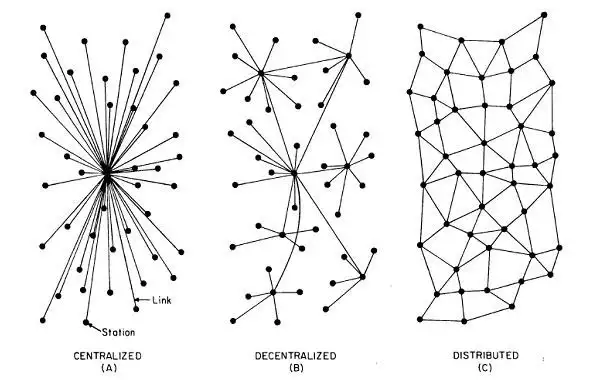
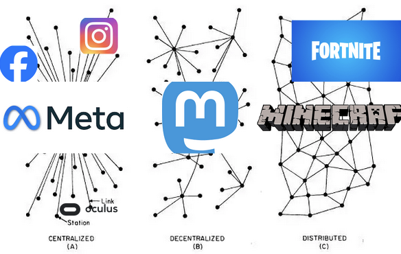

# Week 09: 3/31/26

## Agenda

1. Reading Discussion #6
2. Lecture: Mastodon
3. Tutorial: Mastodon

---

## Mastodon





### What is decentralized?

A server with multiple instances using the same data.

### What is federation?

Ways that different servers can communicate with the same data.

Think about email: you can use @gmail, @nyu, @yahoo, @proton and they are all able to communicate due to federation.

Another example is Discord: you have 1 discord account but you can join a bunch of different discord servers. 

[ActivityPub](https://activitypub.rocks/) is a specific decentralized networking protocol that allows for federation to happen.


### What is Mastodon?

A social media site that leverages ActivityPub to connect each server to one another. Similar to Discord, you have one account that can view multiple servers, but your feed is stored on one server. 

We have our own server! https://networked-media.itp.io/about

## Using *a* Mastodon API

So far, we have only been using APIs with our *own* server. But we can leverage APIs to do things on other servers too! If we are accessing *other* servers, **we don't need to run our own server.js**

After opening our class18 folder in VSCode, we will open our terminal to install our libraries. 

The two libraries we are using today are 

* [dotenv](https://www.npmjs.com/package/dotenv)
* [masto.js](https://github.com/neet/masto.js/)

```sh
npm init -y
npm install masto dotenv
```

We need to only create 2 files today:

* `.env` - this allows us to access and store any variables that we don't want to make public, like our passwords for our bots
* `bot.js` - this will run our bot script

In `.env` we need to connect our bot account to our mastodon account. We need to populate a token variable:

```
TOKEN=
```

The value from this variable comes from Mastodon. So open your Mastodon account → Preferences → Development → New Application

1. Name the application whatever you want 
2. Under "Scopes" find and check the `read` and `write` boxes, highlighted in red text. 
3. Press submit. 
4. Click on your application name and copy `Your access token`. *This is a password and you do not want to expose this publically to the web*.

We will populate the token variable in our `.env` file with this. 

```
TOKEN=abcdefghijklmnopqrstuvwxyz
```

After that, we can start working on our `bot.js` by importing our libraries.

```js
require('dotenv').config();
const m = require('masto');
```

Using the masto library requires us to set up a `RestAPIClient` which will handle constructing our requests for us. 

```js
const masto = m.createRestAPIClient({
	url: 'https://networked-media.itp.io/',
	accessToken: process.env.TOKEN,
});
```

Then, we can write a function that allows us to leverage the API to write a text status for us.

```js
async function makeStatus(text) {
	const status = await masto.v1.statuses.create({
		status: text,
		visibility: 'private',
	});
}
```

Lastly, we can set up an interval to use this function:

```js
setInterval(() => {
	let emoji = ['😭', '🤩', '💖'];

	let rand = Math.floor(Math.random() * emoji.length);

	let post = emoji[rand];

	makeStatus(post);
}, 5000);
```

We can run our bot from our terminal using 

```js
node bot.js
```

